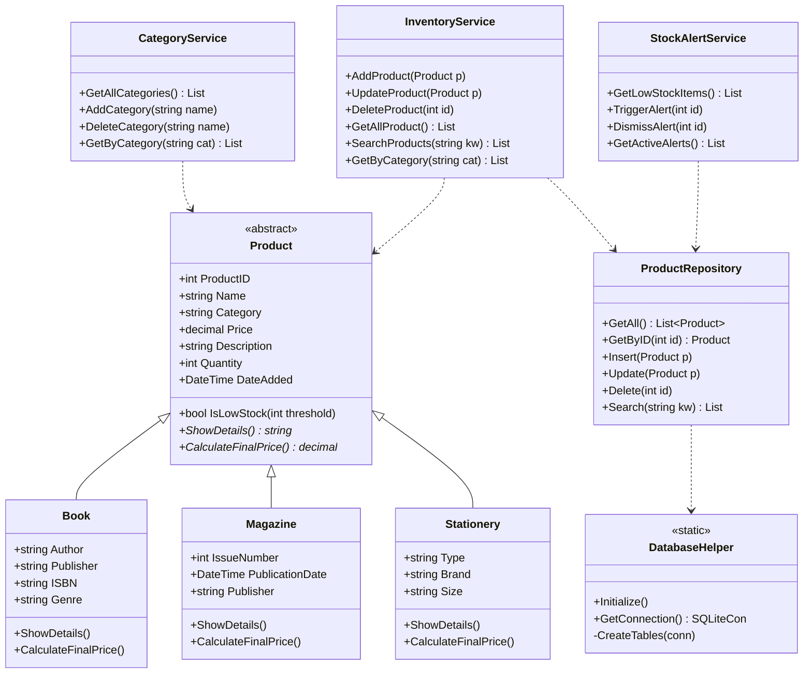
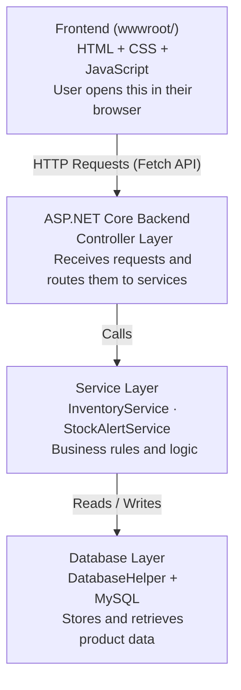

<div align="center">

# ShelfSense

### Smart Bookstore Inventory Management System


*A web-based inventory system built for bookstores — accessible from any browser.*

</div>

---

## Description

**ShelfSense** is a web-based bookstore inventory management system. It allows bookstore owners and staff to manage their catalog of Books, Magazines, and Stationery through a browser interface — no app installation required.

The system is built on **ASP.NET Core (.NET 10)** for the backend and plain **HTML, CSS, and JavaScript** for the frontend. All data is stored in a **MySQL** database. The architecture follows a clean **3-layer OOP design** (UI → Service → Data), and the product type system uses C# inheritance so that a `Book`, `Magazine`, or `Stationery` is defined by its class — not a text label.

> The goal of ShelfSense is to replace manual inventory tracking with a reliable, centralized digital system that reduces errors and keeps stock levels visible at all times.

<div align="center">

| | |
|:--|:--|
| **Platform** | Web (browser-based) |
| **Backend** | C# / ASP.NET Core (.NET 10) |
| **Frontend** | HTML, CSS, JavaScript |
| **Database** | MySQL — MySqlConnector 2.5.0 |
| **Architecture** | 3-layer OOP: UI / Service / Data |
| **Product types** | Book, Magazine, Stationery |

</div>

---

## UML Diagram



</div>

---

## Features

<div align="center">

| Feature | Description |
|:--|:--|
| Add product | Register a Book, Magazine, or Stationery item into the inventory |
| Update product | Edit the details or stock quantity of any existing product |
| Delete product | Remove a product that is no longer in the catalog |
| Search | Find items by name or keyword |
| Filter by category | Browse only Books, only Magazines, or only Stationery |
| Smart pricing | Automatically applies discounts based on product type |
| Low stock alerts | Flags products below a set threshold and triggers dashboard alerts |
| Product details | Shows type-specific fields (e.g., ISBN for books, issue number for magazines) |

</div>

---

## Pricing Rules by Product Type

<div align="center">

| Product type | Discount rule | Example |
|:--:|:--|:--|
| Book | 10% student discount — always applied | P500.00 → P450.00 |
| Magazine | No discount | P120.00 → P120.00 |
| Stationery | 5% bulk discount when quantity is 10 or more | P15.00 → P14.25 |

</div>

---

## Stock Alert Levels

<div align="center">

| Condition | Status | System action |
|:--:|:--:|:--|
| Quantity above threshold | Normal | No action |
| Quantity at or below threshold | Low stock | Alert triggered — highlighted on dashboard |
| Quantity is zero | Out of stock | Critical alert — flagged as unavailable |

</div>

---

## How the Program Works



When a user interacts with the app (e.g., clicks "Add Book"), the browser sends a request to the ASP.NET Core backend. The **Controller** receives it and delegates to the **Service layer**, which applies the business logic (e.g., validating the product or checking stock). The **DatabaseHelper** then communicates with MySQL to save or retrieve data, and the result is sent back to the browser.

### OOP Principles Applied

**Abstraction** — The abstract `Product` class defines a shared contract for all product types. Every product has a name, price, quantity, and date added. Subclasses must implement `ShowDetails()` and `CalculateFinalPrice()`.

**Inheritance** — `Book`, `Magazine`, and `Stationery` all extend `Product`. The subclass *is* the category — no string labels or extra category tables needed.

**Polymorphism** — The service layer works against the `Product` base type. C# resolves the correct subclass behavior at runtime automatically.

```csharp
foreach (Product p in products)
{
    string details = p.ShowDetails();         // different output per type
    decimal price  = p.CalculateFinalPrice(); // different discount per type
    bool low       = p.IsLowStock(5);         // shared — no override needed
}
```

**Encapsulation** — The frontend never touches the database directly. All communication goes through the API: Controllers call Services, which call the Database layer.

---

## Project Structure

```
ShelfSense/
│
├── Controller/           API endpoints — receives and routes requests
├── Database/             DatabaseHelper — MySQL connection and queries
├── Models/               Product (abstract), Book, Magazine, Stationery
├── Services/             InventoryService, StockAlertService
│
├── wwwroot/              Frontend — served as static files
│   ├── html/             HTML pages
│   ├── css/              Stylesheets
│   └── js/               JavaScript — fetch API calls to backend
│
├── Program.cs            Entry point — registers services, sets up routing
├── appsettings.json      Configuration (MySQL connection string)
├── appsettings.Development.json
└── ShelfSense.csproj     Project file — net10.0 + MySqlConnector 2.5.0
```

---
## Prerequisites

Before running ShelfSense, make sure you have the following installed:

| Tool | Version | Purpose | Download |
|:--|:--|:--|:--|
| .NET SDK | 10.0+ | Runs the ASP.NET Core backend | [dotnet.microsoft.com](https://dotnet.microsoft.com/en-us/download/dotnet/10.0) |
| XAMPP | Latest | Provides the MySQL database server | [apachefriends.org](https://www.apachefriends.org/download.html) |
| Visual Studio Code | Latest | Code editor | [code.visualstudio.com](https://code.visualstudio.com/) |
| C# Dev Kit | Latest | VS Code extension for C# | Install inside VS Code |
| Git | Latest | Clone the repository | [git-scm.com](https://git-scm.com/) |

---

## Getting Started

### 1. Clone the Repository

```bash
git clone https://github.com/itskowalskiii/ShelfSense.git
cd ShelfSense
```

### 2. Start MySQL

Open **XAMPP Control Panel** and start **MySQL**.

### 3. Create the Database

```bash
mysql -u root -p
```

```sql
CREATE DATABASE ShelfSenseDatabase;
USE ShelfSenseDatabase;
SOURCE path/to/shelfsense_db.sql;
```

> Replace `path/to/shelfsense_db.sql` with the actual file path.

### 4. Configure Connection String

Edit `appsettings.json`:

```json
{
  "ConnectionStrings": {
    "DefaultConnection": "Server=localhost;Database=ShelfSenseDatabase;User=root;Password=;"
  }
}
```

> Add your MySQL password if needed.

### 5. Restore Dependencies

```bash
dotnet restore
```

### 6. Run the Application

```bash
dotnet run
```

### 7. Open the App

Open the URL shown in the terminal or press **F5** in VS Code.

---

## Troubleshooting

| Problem | Solution |
|:--|:--|
| Cannot connect to database | Make sure MySQL is running in XAMPP and the credentials in `appsettings.json` are correct |
| `dotnet` command not found | Install .NET 10 SDK from [dotnet.microsoft.com](https://dotnet.microsoft.com/en-us/download/dotnet/10.0) |
| Page does not load | Confirm `dotnet run` is active and visit the exact URL shown in the terminal |
| `MySqlConnector` error | Run `dotnet restore` to reinstall packages |
| Port already in use | Change the port in `launchSettings.json` or close the app using that port |
| Database not found | Make sure you ran the `.sql` file and the database name matches `appsettings.json` |

---

## Developers

<div align="center">

| Name | Role |
|:--:|:--:|
| Alday, Paul Dharren | GUI Designer |
| Larga, Erika Ysobelle U. | Project Manager |
| Tosino, Myk Angelo | Logic Developer |

</div>

---

<div align="center">

Made with love by the ShelfSense Team · Powered by ASP.NET Core & MySQL

</div>
